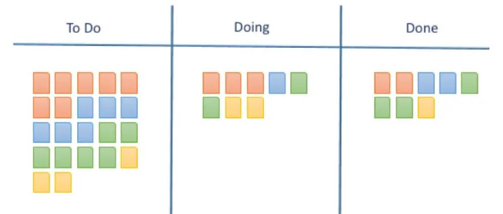

# Kanban

## KANBAN

Kanban jest podejściem zarządczym, którego celem jest wizualizacja i optymalizacja przepływu pracy w łańcuchu wartości dodanej.

## **Najważniejsze elementy -**  **keypoints**

### Tablica Kanban

Podziel główne zadania na mniejsze taski, każdy task zapisz na oddzielnej kartce i umieść je na tablicy i użyj kolumn z odpowiednimi nazwami by określić w na którym etapie prac jest konkretny task. 

### Limit pracy w toku \(Work in Progress\)

Przypisz konkretny limit pracy in progress \(work in progress \(WIP\)\) – ile konkretnie zadań może być wykonywanych jednocześnie. 

### Czas realizacji 

Średni czas ukończenia jednego zadania, czasem nazwany “czasem cyklu”. Zoptymalizuj cały proces tak, by czas jego realizacji był jak najkrótszy i jak najbardziej przewidywalny.

