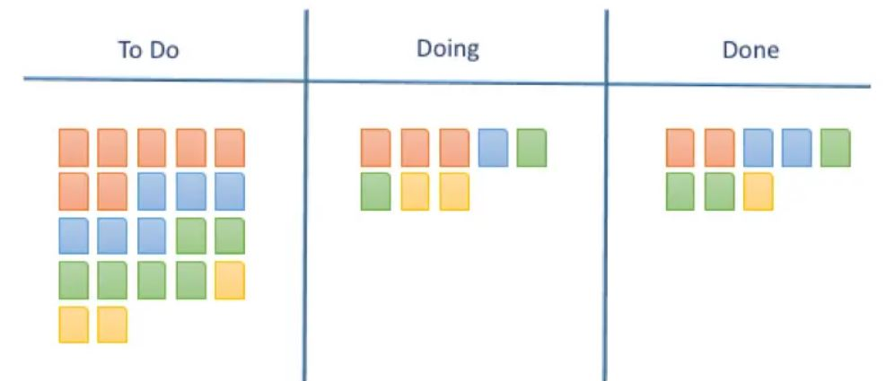

# KANBAN

## Kanban

Czyli „Spis widoczny” W Kanban ważna jest elastyczna konfiguracja procesu produkcyjnego, by zapewnić zdolność podjęcia realizacji priorytetowych zadań w niemal dowolnej chwili. Metoda opiera się na zwinnym zarządzaniu procesem wytwórczym w oparciu o aktualne potrzeby i priorytety.

Kanban jest podejściem zarządczym, którego celem jest wizualizacja i optymalizacja przepływu pracy w łańcuchu wartości dodanej.

## **Najważniejsze elementy -**  **keypoints**

### Tablica Kanban

Podziel główne zadania na mniejsze taski, każdy task zapisz na oddzielnej kartce i umieść je na tablicy i użyj kolumn z odpowiednimi nazwami by określić w na którym etapie prac jest konkretny task. 

### Limit pracy w toku \(Work in Progress\)

Przypisz konkretny limit pracy in progress \(work in progress \(WIP\)\) – ile konkretnie zadań może być wykonywanych jednocześnie. 

### Czas realizacji 

Średni czas ukończenia jednego zadania, czasem nazwany “czasem cyklu”. Zoptymalizuj cały proces tak, by czas jego realizacji był jak najkrótszy i jak najbardziej przewidywalny.

## Kanban w tworzeniu oprogramowania

* Wizualizacja – zawsze dostępna tablica z zadaniami i ich aktualnymi statusami
* Ograniczenie pracy w toku – liczba zadań w toku jest ograniczona, zanim podejmiemy kolejne zadania należy zakończyć poprzednie 
* Zarządzanie przepływem – bieżąca ocena realizowanych zadań i optymalizacja procesów

## Kanban – praca w toku 

**Praca w toku = czas cyklu x przepustowość systemu** 

Przykład: czas cyklu = 2 dni przepustowość = 3 zadania/dzień Praca w toku = 6 zadań

## Kanban - eliminacja strat 

**Muda** – bez wartości dodanej, nieekonomicznie 

**Mura** – bez standaryzacji i regularności 

**Muri** – nieergonomicznie, z przeciążeniem źródło: snhomeworkvpqi.fx-brokers-review.com

`źródło: snhomeworkvpqi.fx-brokers-review.com`

