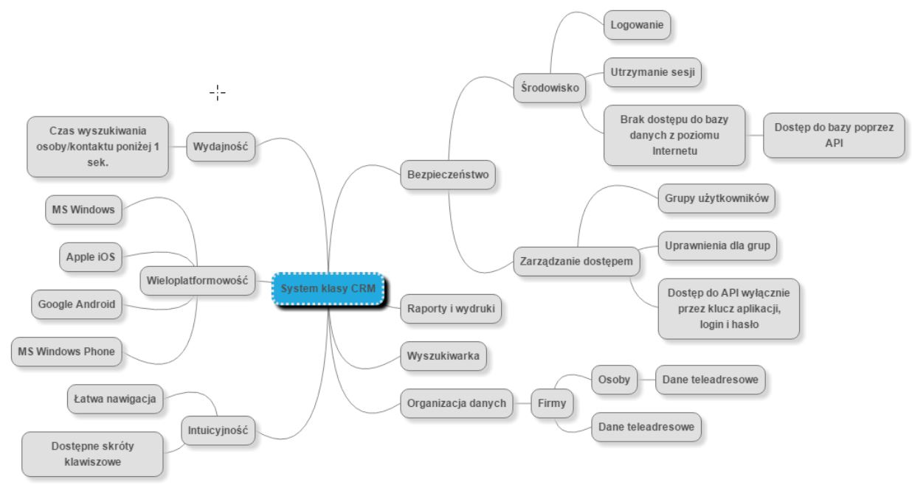

# Mapa myśli

Mapa myśli \(ang. mind map\) stanowi szczególny rodzaj zapisu, który może być z powodzeniem wykorzystywany do opracowania koncepcji systemów informatycznych. 

W mapach myśli w środku zawiera zdefiniowany cel projektu, z którego strzałkami wyprowadzone są skojarzenia. Z tych skojarzeń wyprowadzone są kolejne elementy mapy – aż do wyczerpania idei i koncepcji związanych z celem.

### HAPPY FUTURE - przykład mapy myśli



