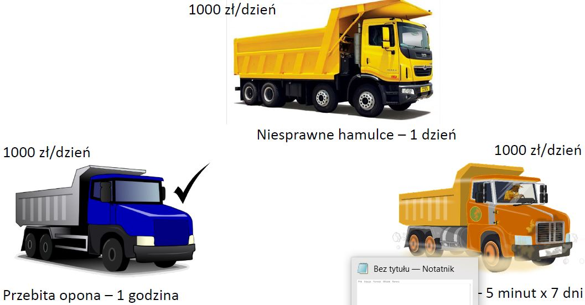
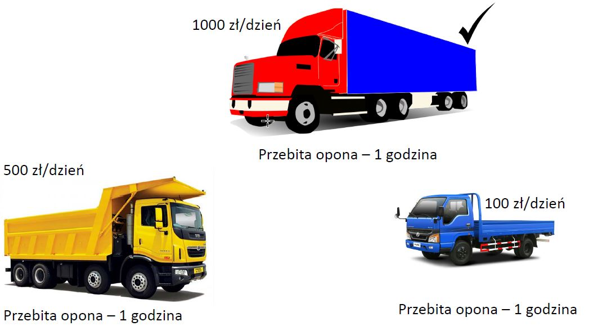
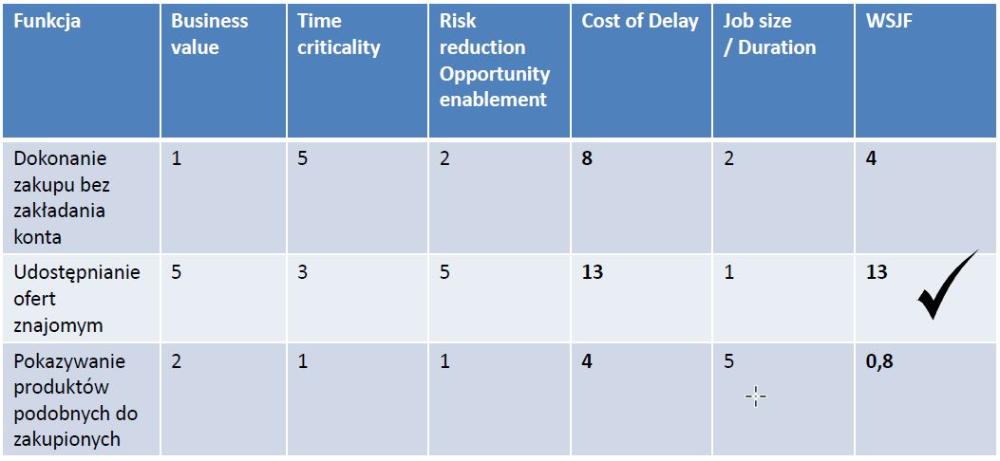

# WSJF

Pozwala na ustalenie priorytetów tak, aby osiągnąć maksymalną korzyść biznesową. 

WSJF = „CoD” / „Job size” \(„Job duration”\)

CoD – „Cost of Delay” 

CoD = „User-business value” + „Time criticality” + „Risk reduction” and/or „Opportunity enablement”

### Klasyfikacja wymagań - WSJF - przykłady

### 1.

### 2.

### 3.

