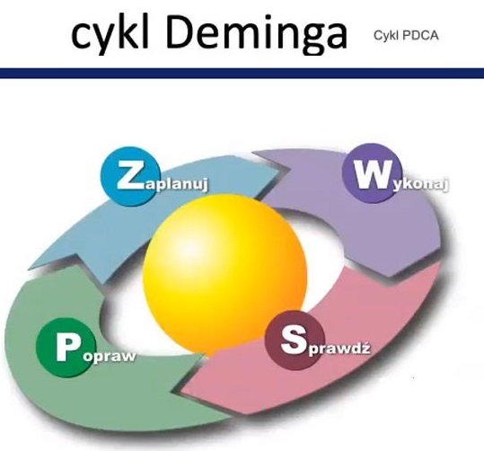
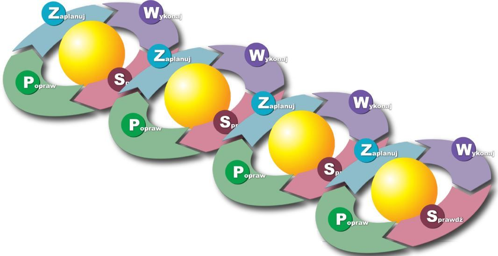

# PDCA

## PDCA - **Plan-Do-Check-Act  -** Cykl Deminga

Schemat ilustrujący podstawową zasadę ciągłego ulepszania. \(dobrym przykładem są nowe wersje Windows’a\)

## Zarządzanie – ciągłe doskonalenie

