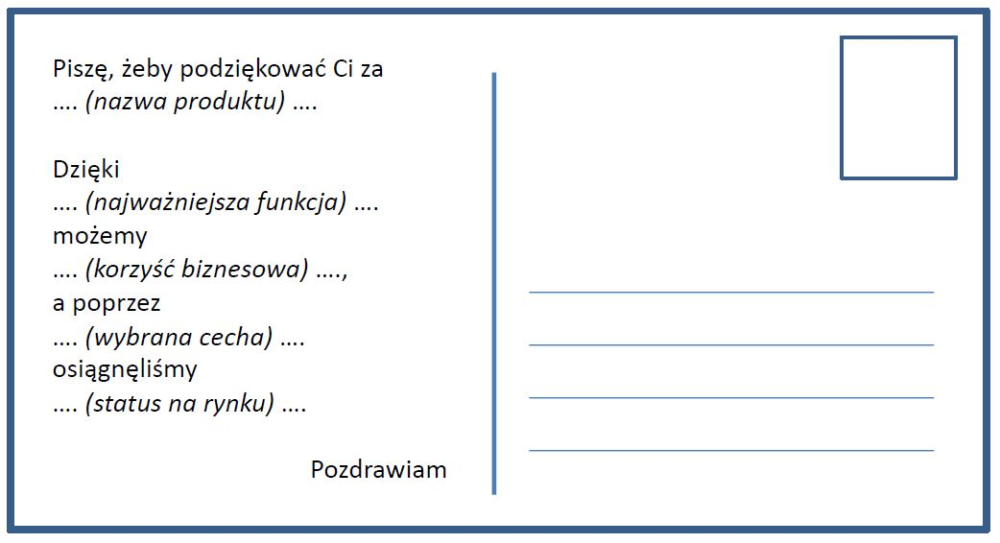
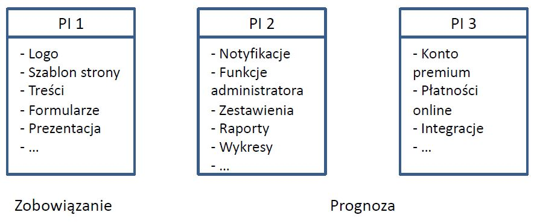
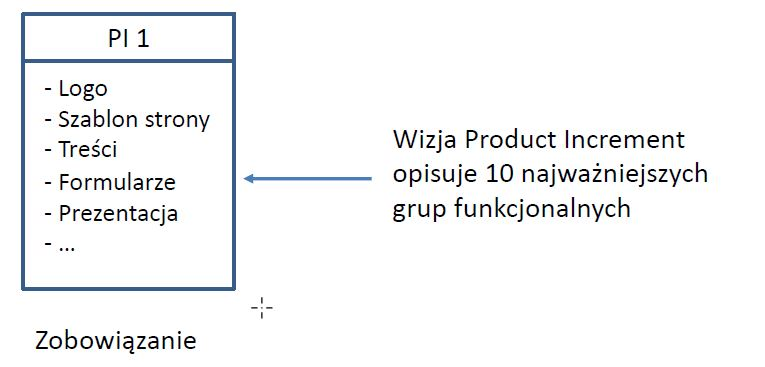

# Analiza i specyfikacja wymagań

## Specyfikacja wymagań

Jeżeli funkcje nowej aplikacji/serwisu stron WWW/rozwiązania są w pełni określone, a wymagania kompletne wówczas analityk wspólnie z klientem opracowuje specyfikację wymagań. 

Jeżeli jest możliwe \(lub konieczne\) opracowanie pełnej specyfikacji wymagań to projekt może zostać zrealizowany z pomocą metodyk klasycznych \(waterfall\).

## WIZJA

* opisuje stan rozwiązania, które zostanie opracowane. 
* odzwierciedla potrzeby interesariuszy, a także funkcje i cechy niezbędne dla realizacji tych potrzeb. 
* odnosi się do stanu docelowego, ale jest osiągalna w określonym czasie. 
* motywuje i angażuje poprzez odwołanie do celów strategicznych biznesu i aspiracji zespołów.


Ludzie w pracy potrzebują kontekstu, pragnąc zrozumieć do czego wnoszą wkład jako większej całości 

Daniel Pink


### Kartka z przyszłości

## Perspektywy analizy wymagań - oprogramowanie 

* Zakres funkcji systemu \(problemy, które chcemy rozwiązać\), 
* Architektura systemu, 
* Technologie IT wykorzystane w projekcie \(systemy operacyjne, bazy danych, języki programowania, dodatkowe narzędzia i biblioteki\), 
* Mechanizmy wymiany/przesyłania danych, 
* Etapy realizacji systemu, 
* Zasoby ludzkie niezbędne do zaprojektowania, wytworzenia, wdrożenia i utrzymania systemu, 
* Interesariusze projektu, 
* Czynniki ryzyka mające wpływ na projekt, 
* Infrastruktura niezbędna do działania systemu, — Wymagania niefunkcjonalne \(np. odnoszące się do jakości, intuicyjności, stabilności, wydajności, bezpieczeństwa, itp.\), 
* Możliwe alternatywy dla przyjętych założeń, 
* Inne – istotne dla projektu.

## Planowanie projektu – mapa drogowa projektu

Aby zrealizować produkt zgodny ze zdefiniowaną wizją należy wydzielić podsystemy lub wskazać kluczowe obszary funkcjonalne. 

Definiując możliwości \(grupy funkcjonalne\) należy pamiętać, że muszą one służyć wizji. 

Mapa drogowa projektu powstaje poprzez zebranie cech i pogrupowanie ich w tzw. Program Increment \(PI\). Program Increment trwa 5 Sprintów.

## Program Increment  - PRZYKŁAD

### Perspektywy analizy: 

#### Wymagania funkcjonalne 

* Jakie funkcje powinno realizować nasze rozwiązanie? 

Dla swojej mapy myśli sprawdź, czy funkcjonalności zostały zebrane w grupy funkcji. Funkcjonalności decydują o algorytmach przetwarzania danych.

#### Wymagania niefunkcjonalne 

Jakie cechy powinno mieć projektowane rozwiązanie? 

[https://en.wikipedia.org/wiki/Non-functional\_requirement](https://en.wikipedia.org/wiki/Non-functional_requirement) 

Dla swojej mapy myśli sprawdź, czy zostały określone grupy wymagań niefunkcjonalnych. Wymagania niefunkcjonalne decydują o architekturze rozwiązania.

#### Program Increment – 10 najważniejszych funkcji 

Aby ustalić priorytety, zespół odpowiedzialny za zarządzanie produktem nadaje priorytety \(np. [MoSCoW ](../narzedzia-planowania-smart-moscow/moscow.md)lub [WSJF](../narzedzia-planowania-smart-moscow/wsjf.md)\)

