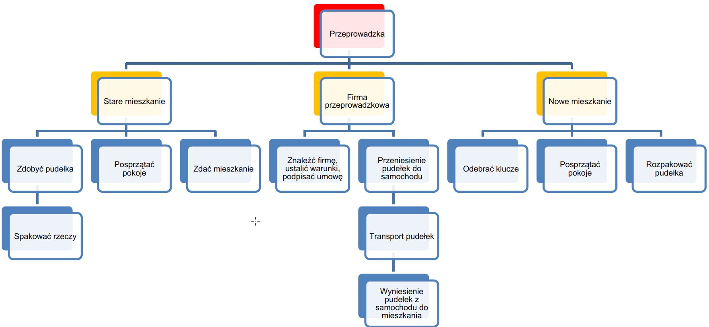

# Planowanie projektu - metodyki KLASYCZNE

## Planowanie projektu 

* Określ cele projektu 
* Stwórz Strukturę Podziału Prac \(WBS\) 
* Zidentyfikuj zadania w projekcie i ustal zależności pomiędzy nimi 
* Określ czas trwania zadań oraz ustal terminy ich zakończenia 
* Zweryfikuj możliwość i terminowość realizacji zadań oraz wpływ na termin zakończenia całego projektu 
* Zidentyfikuj zasoby niezbędne do realizacji projektu 
* Wybierz metodykę i narzędzia potrzebne do realizacji projektu 
* Ustal budżet 
* Określ zasady monitorowania projektu

## Struktura Podziału Prac SPP \(WBS - Work Breakdown Structure\): 

* Określa najmniejsze jednostki zadań \(pakietu prac\)
* Pozwala na określenie niezbędnych zasobów i czynności 
* Ułatwia identyfikację czynników ryzyka 
* Definiuje działania, rezultaty, czasy, koszty i warunki realizacji zadań 

Przy ustalaniu zadań warto stosować metodę 8/80 \(min. 8 godzin na zadanie, maks. 80 godzin na zadanie\)

