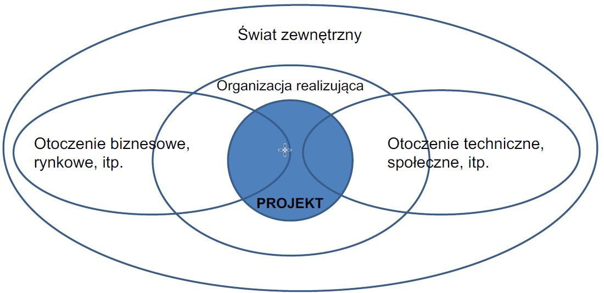

# Dlaczego projekty upadają?

* 16,2% projektów budowy oprogramowania zostało zrealizowanych na czas i w ramach przyjętego budżetu 
* 31,1% projektów zostało anulowanych przed ich zakończeniem 
* 52,7% projektów przekroczyło budżet o 89% względem założeń 
* rezultaty projektów realizowały ok. 42% zakładanych funkcji

## Typowe błędy 

* Niejasne cele projektu 
* Nieprawidłowa ocena wymagań 
* Subiektywna ocena ograniczeń 
* Brak danych i informacji niezbędnych do podejmowania decyzji 
* Brak analizy alternatywnych dróg osiągnięcia celu 
* Brak elastyczności w dostosowaniu sposobu realizacji projektu do zmieniających się warunków 
* Brak lidera w zespole
* Niejasna odpowiedzialność 
* Przerzucanie odpowiedzialności na innych członków zespołu 
* Niewystarczające zasoby \(kadry, finanse, sprzęt, materiały\) 
* Obawy przed zgłaszaniem problemów i niezgodności
* Ignorowanie czynników ryzyka 
* Improwizacja 
* Brak analizy i wniosków dla zakończonych projektów

## Miary sukcesu projektu 

* Zaangażowanie i współpraca interesariuszy projektu 
* Precyzyjne cele projektu 
* Optymalne wymagania i zakres projektu 
* Doświadczony lider zespołu 
* Kompetentny zespół 
* Działanie według przyjętej metodyki 
* Praca ze znanymi narzędziami i infrastrukturą

