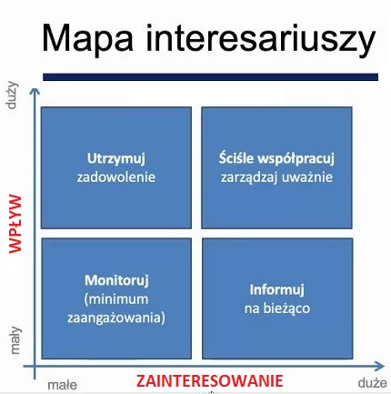
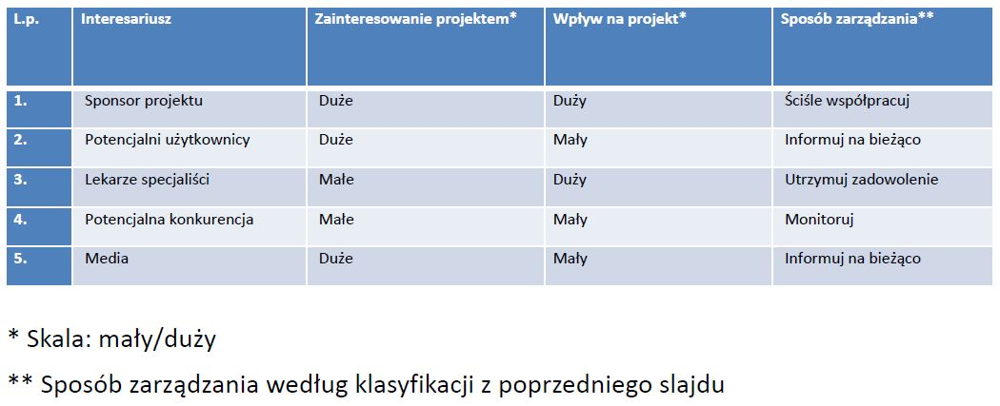

# Projekt

### PRINCE2 

\(**PRoje\`cts IN Contro\`lled Envi\`ronments\)** to metodyka klasyczna

Środowisko zarządcze stworzone w celu dostarczenia jednego lub większej liczby produktów biznesowych zgodnie z określonym uzasadnieniem biznesowym

Projekt ma:

* Określony i skończony czas trwania \(CYKL ŻYCIA\)
* Zdefiniowane i mierzalne produkty biznesowe \(wyniki projektu\)
* Związane z tym działania
* zasoby umożliwiające realizację działań
* Struktura organizacyjna wraz z rolami i przypisanym im zakresem obowiązków, odpowiedzialności i uprawnień.

### Zarządzanie projektami 

Zarządzanie projektami to zespół zadań \(planowanie, organizowanie, kierowanie, kontrola, motywowanie\) podejmowanych dla osiągnięcia celu projektu w ramach przyjętych założeń realizowanych w istniejących uwarunkowaniach.

### Interesariusze 

to osoby lub organizacje, które wpływają na projekt oraz oddziałują na rezultaty projektu, np.:

* Sponsor,
* Kierownik projektu,
* Zespół zarządzający projektem \(Komitet Sterujący\),
* Organizacja realizująca projekt,
* Klient \(użytkownik\),
* Grupy nacisku,
* PMO \(Biuro projektów\),
* Inni uczestnicy.

Projekt: Uruchomienie serwisu wspierającego samodzielną diagnozę chorób

