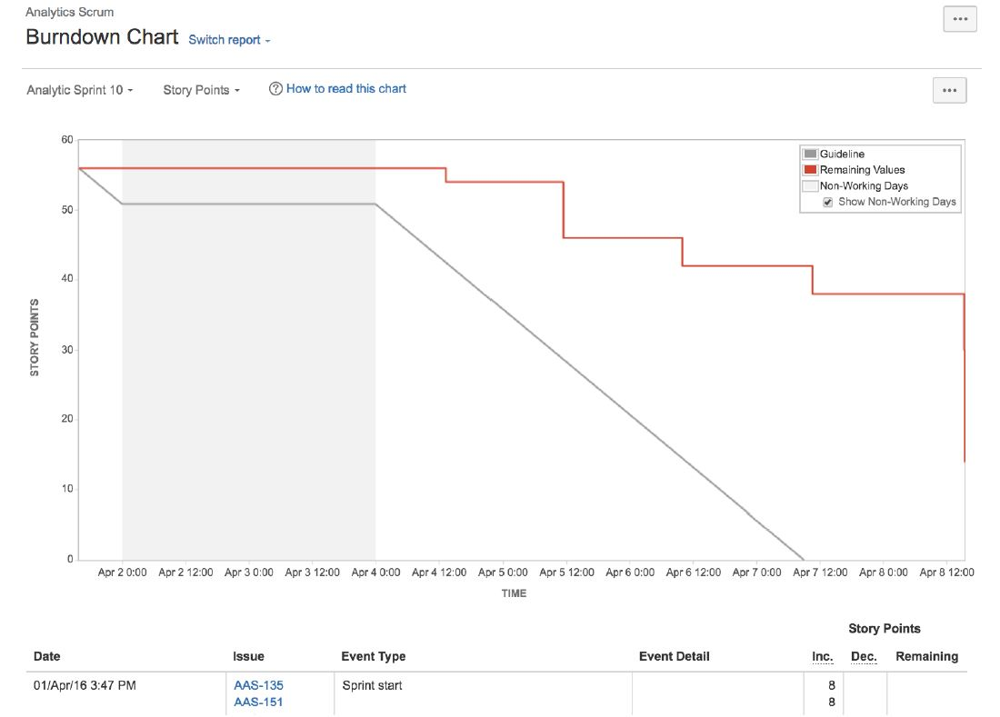
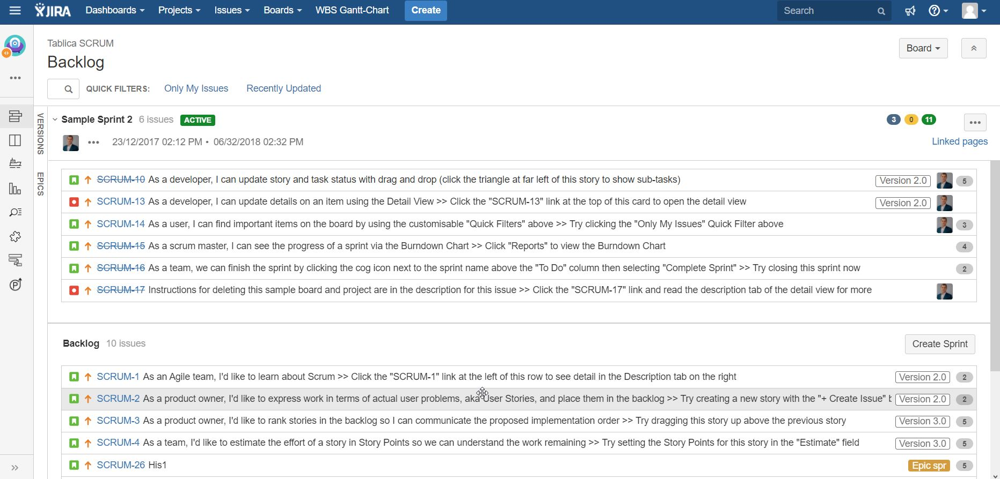

# SCRUM

Metodologia SCRUM opiera się na zdyscyplinowanym zarządzaniu projektem i zakłada częstą weryfikację wymagań i wypracowanych rozwiązań. Kolejne etapy wytwarzania oprogramowania zawierają się w iteracjach, w ramach których przeprowadza się testowanie i weryfikację zgodności wytworzonego kodu programu z przyjętymi założeniami, zbiera się wymagania uzupełniające oraz planuje zadania na kolejną iterację.

## **Scrum – role**

1. Zespół Deweloperski – interdyscyplinarny. 
2. Product Owner \(Właściciel Produktu\).
3. Scrum Master.

### **Scrum to podejście, które obejmuje następujące praktyki:**

* Sprint
* Przyrost produktu
* Backlog produktu
* Backlog sprintu
* Definition of Done \(definicja ukończenia\)
* Timeboxing \(ograniczenia czasowe\)
* Przejrzystość – status i Daily Scrum

## Reguły SCRUM 


**Celem projektu jest zadowolenie klienta realizowane przez częste dostawy kolejnych wersji oprogramowania.** 


* **Zmiany i doprecyzowania wymagań** są cechą naturalną wynikającą z lepszego rozumienia cech wytwarzanego oprogramowania. 
* **Klient** \(Właściciel produktu\) jest **stale zaangażowany** w proces wytwarzania oprogramowania.


**Zespół** realizujących projekt \(zazwyczaj **5 – 8 osób**\) musi się codziennie spotykać i omawiać zadania zrealizowane i pozostające do wykonania.


* Stała dbałość o jakość i dobry projekt jest kluczem do zamknięcia projektu. 
* Uczestnicy projektu sami dokonują wyboru zadań do realizacji. 
* Tworzeniem środowiska pracy zajmuje się **SCRUM Master,** który wspiera walkę świń przeciwko kurczakom.

### Product backlog - zaległości produktowe

* Wymagania Właściciela produktu zebrane są w listę \(**Zaległości produktowe**\). 
* Każda zaległość produktowa ma ustaloną złożoność wyrażoną przez **Story Points**. Szybkość realizacji zadań \(wypalania\) może się zmieniać w zależności od postępu prac. 
* Do zaległości produktowych można dodawać nowe elementy \(w tym np. zmiany wymagań klienta, czy zmiany technologiczne\). 
* Priorytety na liście zaległości ustala Właściciel produktu.

### Sprint

* Realizacja projektu organizowana jest w Sprintach \(okresowych spotkaniach Zespołu\) i w codziennych SCRUM-ach \(**Daily Scrum -** krótkie spotkanie – co zrobiłeś, – jakie miałeś przeszkody? – co planujesz zrobić?\). 
* Pierwsze spotkanie to Sprint planujący \(zebranie Userstories, opracowanie arkusza zaległości produktowych \(Product backlog\). 
* Zadania muszą być podzielone na fragmenty, których wielkość to max. kilkanaście Story Points.
* Jeden raz na miesiąc \(dla małych projektów częściej, np. 1/tydzień\) odbywa się Sprint, gdzie omawiany jest wynik pracy Zespołu \(prezentacja produktu\), weryfikowany jest arkusz zaległości produktowych i zaległości sprintu oraz planowane są zadania na kolejny Sprint. 


Dokumentacja SCRUM opiera się na arkuszu 

* zaległości produktowych \(Backlog produktu\)
* liście zaległości Sprintu \(Backlog Sprintu\)
* wykresie wypalania.


## Scrum'y - meeting'i

### **Daily Scrum**

* Co skończyłeś od poprzedniego spotkania?
* Co planujesz skończyć do następnego spotkania?
* Co blokuje Ci pracę?

### Backlog Refinement Meeting

* **W połowie Sprintu** organizowany jest Backlog Refinement Meeting, którego celem jest doprecyzowanie zadań w Backlogu, ich estymacja oraz wstępne określenie priorytetów. 

### Retrospective Meeting

* Po zakończonym Sprincie organizowany jest Retrospective Meeting, którego celem jest podsumowanie ostatniego Sprintu \(Co poszło dobrze, Co wymaga poprawy, Działania do podjęcia w czasie następnego Sprintu\).

Codzienne spotkanie, które angażuje członków zespołu, także testerów, na którym podają oni  aktualny status swoich zadań. Zbiór pytań dla każdego członka zespołu to:

## Przykłady

### Wykres wypalania 

### Backlog 

d

