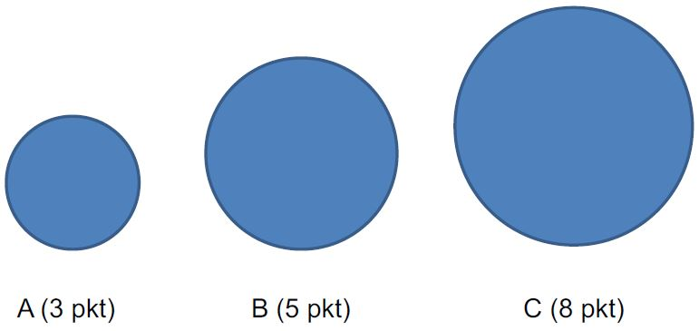

# Szacowanie czasochłonności

Podjęcie decyzji o realizacji projektu informatycznego wymaga poznania \(określenia\) jego kosztów. W przypadku metodyk klasycznych \(pełna specyfikacja\) możliwe wydaje się precyzyjne ustalenie czasu realizacji, a tym samym kosztów. W przypadku metodyk zwinnych na etapie wyceny pełna specyfikacja nie istnieje.

## Triangulacja 

Ze względu na różnice w ocenie faktycznego czasu niezbędnego do realizacji całego systemu w metodykach zwinnych stosuje się metodę triangulacji, tj. szacowanie czasochłonności dla mniejszych zadań \(najczęściej – historyjek użytkownika\) i w oparciu o jednostki względne \(story points\).

Story points pozwalają na zakodowanie zarówno obszerności \(złożoności/wielkości\) zadania jak i uwzględnienie wydajności pracy. Im większe \(złożone, czasochłonne, trudne\) zadanie \(historyjka\) tym liczba przydzielonych punktów powinna być większa. Przydział punktów powinien być względny, tj. różnice w złożoności implementacji historyjek powinny być odzwierciedlone w liczbie przydzielonych punktów.

Przykładowy podział story points:

Techniki szacowania relatywnego bazują często na liczbach ciągu Fibonacciego, tj. 1, 2, 3, 5, 8, … W przydziale story points istotne jest uchwycenie różnic w „wielkości” zadania, stąd w szacowaniu nie ma wielkiego znaczenia, czy zadanie ma 7, 8, czy 9 SP.

Liczba ukończonych SP w jednostce czasu pozwala na określenie wydajności i przybliża/weryfikuje szacunkowy termin realizacji całego projektu. W metodykach zwinnych termin zakończenia prac jest zmienny, ważne jest jednak żeby stale monitorować, czy zmierzamy do zakończenia projektu i kiedy to może nastąpić.

## Poker planistyczny 

Celem szacowania \(i triangulacji\) historyjek użytkownika jest odpowiedź na pytanie – jaka będzie faktyczna czasochłonność i tym samym koszt całego systemu informatycznego. Spostrzeżenie: jeżeli jedno zadanie jest szacowane przez kilka osób to szacunki będą różniły się od siebie.

Poker planistyczny pozwala: 1.Wyeliminować nadmierny optymizm związany z szacowaniem. 2.Ograniczyć wpływ autorytetów na szacunki. 3.Wyjaśnić lub doprecyzować wymagania.

W praktyce wspólne szacowanie historyjek użytkowników pozwala na lepsze rozumienie wymagań klienta. W przypadku wątpliwości odnośnie wymagań muszą być one wyjaśnione z klientem. Powinniśmy szacować tylko te zadania, na których realizacji się znamy.

Przykład szacowania czasochłonności Zadania A: Osoba 1: 8 SP Osoba 2: 3 SP Osoba 3: 5 SP Osoba 4: 12 SP -&gt; Wymaga wyjaśnienia \(nie eliminujemy takiej informacji\) lub rozbicia Zadania na mniejsze części

Przykład szacowania czasochłonności Zadania A – po wyjaśnieniu: Osoba 1: 8 SP Osoba 2: 3 SP Osoba 3: 5 SP Osoba 4: 5 SP Wynik: średnia z szacunków, tj.: 5 SP

