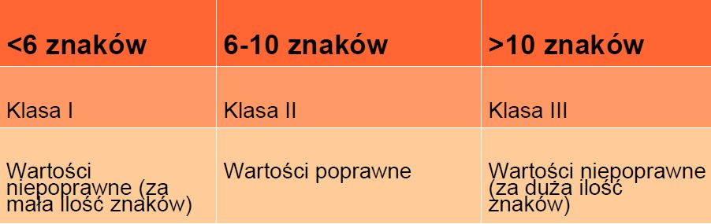

# 1.	Klasy równoważności

## Klasy równoważności \(equivalence partitioninng\)  

Techniki podziału na klasy równoważności \(ang. equivalence partitioning\) używa się do zmniejszenia liczby przypadków testowych wymaganych do efektywnego testowania. 

Wejścia programu lub systemu są dzielone na grupy, które powodują podobne zachowanie oprogramowania, więc wysoce prawdopodobne jest to, że są przetwarzane w ten sam sposób. Przyjmuje się, że w przypadku wybrania jednej reprezentatywnej wartości z danej klasy jest zapewnione pokrycie wszystkich elementów tej klasy.

Klasy równoważności można znaleźć dla danych poprawnych \(wartości, które powinny zostać zaakceptowane\) oraz niepoprawnych \(wartości, które powinny zostać odrzucone\).

* dla danych poprawnych \(wartości, które powinny zostać zaakceptowane\)
* niepoprawnych \(wartości, które powinny zostać odrzucone\)
* dla wyjść
* wartości wewnętrznych
* wartości zależnych od czasu \(np. przed lub po zajściu jakiegoś zdarzenia\)
* oraz parametrów interfejsów \(np. komponentów integrowanych i testowanych podczas testów integracyjnych\)

Klasy równoważności można stosować na każdym poziomie testowania, w sytuacjach, gdy wszystkie elementy zbioru wartości do przetestowania mają zostać przetworzone w taki sam sposób i gdy zbiory wartości używanych przez aplikację nie nakładają się na siebie.

 Ta technika sprawdza się najlepiej w połączeniu z analizą wartości brzegowych, która rozszerza listę testowanych wartości o wartości brzegowe klas równoważności. Jest to typowa technika umożliwiająca szybkie ustalenie, czy działają podstawowe funkcjonalności.

## Przykład: 

Ilość znaków w polu "Hasło" nie może być krótsza niż 6 znaków i dłuższa niż 10 znaków.

Po wydzieleniu klas równoważności przy projektowaniu przypadków testowych możemy wybrać tylko po jednej wartości z danej klasy, np.: 

* TC1 – Klasa I – hasło zawierające 4 znaki
* TC2 – Klasa II - hasło zawierające 8 znaków 
* TC3 – Klasa III - hasło zawierające 15 znaków

