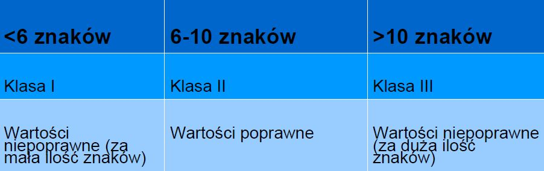

# 2.	Analiza wartości brzegowych

## Analiza wartości brzegowych/granicznych \(ang. boundary values analysis, BVA\) 

Służy do testowania wartości na granicach uporządkowanych klas równoważności. 

Podczas projektowania testów tworzy się przypadek testowy dla każdej wartości brzegowej.

## Wartości brzegowe \(graniczne\): 

* Minimum i maksimum klasy równoważności to jej wartości brzegowe 
* Wartość brzegowa poprawnego przedziału jest nazywana poprawną wartością brzegową, a wartość brzegowa niepoprawnego przedziału – niepoprawną wartością brzegową 
* Testy można zaprojektować tak, żeby pokrywały zarówno poprawne jak i niepoprawne wartości brzegowe


Ta technika ma zastosowanie **na wszystkich poziomach testowania** i można jej użyć, gdy istnieją uporządkowane klasy równoważności.



Istnieją dwa sposoby zastosowania tej techniki: testowanie **dwóch** i **trzech** wartości


### Testowanie dwóch wartości – przykład

Klasa równoważności zawiera wartości od 1 do 10 z inkrementacją o 0,5.

1. Test dwóch wartości dla górnej granicy uwzględnia wartości 10 i 10,5 
2. Test dwóch wartości dla dolnej granicy uwzględnia wartości 1 i 0,5 

Granice są określone jako maksymalna i minimalna wartość zdefiniowanej klasy równoważności.

### Testowanie trzech wartości – przykład

Klasa równoważności zawiera wartości od 1 do 10 z inkrementacją o 0,5. 

1. Test trzech wartości dla górnej granicy uwzględnia wartości 9,5, 10 i 10,5 
2. Test trzech wartości dla dolnej granicy uwzględnia wartości 1,5, 1 i 0,5 

Granice są określone jako maksymalna i minimalna wartość zdefiniowanej klasy równoważności.

### Przykład

Ilość znaków w polu "Hasło" nie może być krótsza niż 6 znaków i dłuższa niż 10 znaków.

Przypadki testowe i ilość znaków przy sprawdzeniu wartości granicznych:

* TC1: 5 
* TC2: 6 
* TC3: 7 
* TC4: 9 
* TC5: 10 
* TC6: 11

