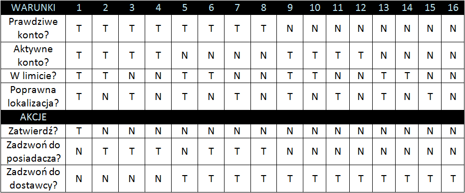
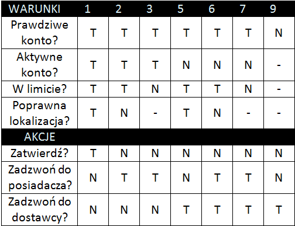

# 3.	Tablice decyzyjne

## Tablice decyzyjne 

służą do testowania współdziałania kombinacji warunków. Testowanie przy użyciu tablic decyzyjnych ma zapewnić, ze zostaną przetestowane wszystkie kombinacje warunków, relacji i ograniczeń.

## Standardowe pokrycie 

dla testowania w oparciu o tablicę decyzyjna wymaga zaprojektowania jednego testu dla każdej kolumny w tablicy 

## Minimalne pokrycie testami 

w przypadku tablicy decyzyjnej uzyskuje się poprzez przygotowanie co najmniej jednego przypadku testowego dla każdej kolumny. Zakłada się przy tym, że nie istnieją warunki złożone i że w kolumnie uwzględniono wszystkie możliwe kombinacje warunków. 


Techniki analizy wartości brzegowych i klas równoważności uzupełniają technikę tablic decyzyjnych.


## Redukcja tablicy decyzyjnej

Próba przetestowania wszystkich możliwych kombinacji może prowadzić do powstania ogromnych tablic decyzyjnych. Można strategicznie zmniejszyć liczbę kombinacji ze wszystkich możliwych do tylko tych „interesujących” poprzez tzw. **testowanie w oparciu o zredukowane tablice decyzyjne**. 

Przy użyciu tej techniki można ograniczyć listę kombinacji do takich, które wygenerują różne sytuacje wyjściowe, usuwając zestawy warunków, które nie mają znaczenia dla rezultatu. Jeśli wartości w jednym lub więcej warunkami nie mogą wpływać na akcje dla dwóch lub więcej kombinacji warunków, możemy redukować tablicę decyzyjną. 

Wymaga to łączenia dwóch lub więcej kolumn. Pierwszy krok to znalezienie dwóch kolumn, które mają te same akcje na wyjściu \(dla wszystkich akcji\).

Drugi krok to zastąpienie tych warunków, które są różne w dwóch kolumnach przez „-” oznaczające „nie ma znaczenia” lub „nie wydarzy się”.


**Tę technikę stosuje się z reguły na poziomach testów integracyjnych, systemowych i akceptacyjnych, czasami w testowaniu modułowym, jeżeli dany moduł zawiera logikę decyzyjną.** 


Technika tablic decyzyjnych jest szczególnie przydatna, gdy wymagania są zapisane w postaci diagramów przepływu lub tabel reguł biznesowych. Przy projektowaniu tablic decyzyjnych należy uwzględnić zarówno zdefiniowane kombinacje warunków, jak i takie, które nie są jawnie wskazane, ale wystąpią w praktyce. Tablica decyzyjna jest dobrym narzędziem projektowania testów tylko wtedy, gdy zostały w niej uwzględnione wszystkie warunki, które wchodzą ze sobą w interakcje.



