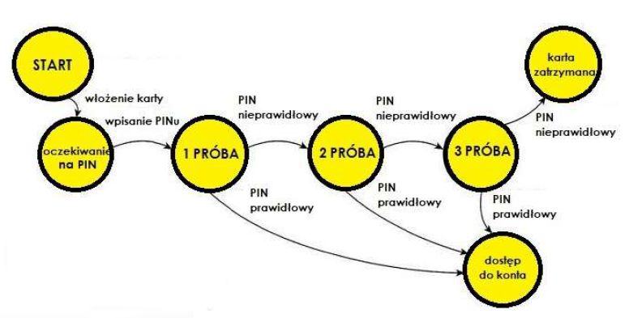

# 4.	Testowanie przejść między stanami

\(ang. state transition testing\) umożliwia weryfikację zdolności oprogramowania do wchodzenia w zdefiniowane stany i wychodzenia z nich poprzez poprawne i niepoprawne przejścia. W reakcji na zdarzenia oprogramowanie zmienia stan i wykonuje działania.

Zdarzenia mogą mieć dodatkowy kwalifikator warunku \(nazywany czasem warunkiem dozoru albo warunkiem sprawdzającym przejścia\), który wpływa na wybór ścieżki przejścia.

Do śledzenia przejść pomiędzy stanami używa się albo **diagramu** **przejść** **pomiędzy stanami**, który przedstawia w postaci graficznej wszystkie poprawne przejścia pomiędzy stanami, albo **tablicy stanów**, która zawiera wszystkie możliwe przejścia, zarówno poprawne, jak i niepoprawne.

Aby stworzyć prosty **diagram przejść pomiędzy stanami**, wystarczy zidentyfikować i określić:

*  listę stanów
* możliwe przejścia między stanami

### **Stan** \(ang. state\) 

reprezentuje określone warunki, w jakich znajduje się obiekt lub status, jaki może on posiadać. Stany wykluczają się nawzajem – obiekt może być w określonym czasie tylko w jednym stanie. Aby je zidentyfikować, należy przeanalizować dziedzinę biznesową \(problemową\).

Obiekt powinien posiadać:

* stan początkowy \(np. utworzony, nowy\)
* stany pośrednie \(np. zatwierdzony, oczekujący\)
* stan końcowy \(np. usunięty, zakończony\)

### **Przejście** \(ang. transition\) 

reprezentuje zachowanie, które powoduje zmianę stanu obiektu \(z określonego stanu do jednego ze stanów możliwych dla niego do osiągnięcia\). Przejścia mogą być wyzwalane przez zakończone aktywności, zdarzenia czy inne wyzwalacze, ale tylko te, na które odpowiada obiekt będąc w danym stanie.

**Obszar zastosowania -** można zastosować w przypadku każdego oprogramowania o zdefiniowanych stanach, w którym występują zdarzenia powodujące przejścia pomiędzy tymi stanami \(np. przejścia na inny ekran aplikacji\):

* oprogramowanie wbudowane
* strony WWW i transakcyjne
*  systemy sterowania, np. sterowniki sygnalizatorów świetlnych.


Testowanie przejść pomiędzy stanami sprawdza się **na wszystkich poziomach testowania.** 


## Przykład

### Diagram

Stany - żółte kółka; Przejścia – strzałki; Zdarzenia, zakończone aktywności - opisy przy przejściach.

### Przypadki testowe dla przykładowego diagramu:

* TC1 – włożenie karty, oczekiwanie na wpisanie PINu, poprawny PIN jest wpisany za pierwszym razem i uzyskujemy dostęp do konta 
* TC2 – włożenie karty, oczekiwanie na wpisanie PINu, niepoprawny PIN jest wpisany 3 razy i karta zostaje zatrzymana 
* TC3 – włożenie karty, oczekiwanie na wpisanie PINu, niepoprawny PIN jest wpisany 1 raz, następnie jest wpisany poprawny PIN i uzyskujemy dostęp do konta 
* TC4 – włożenie karty, oczekiwanie na wpisanie PINu, niepoprawny PIN jest wpisany 2 razy, następnie jest wpisany poprawny PIN i uzyskujemy dostęp do konta

### Tablica stanów 

zawiera wszystkie możliwe przejścia, zarówno poprawne, jak i niepoprawne, na przykład:

|  | PIN prawidłowy  | PIN nieprawidłowy |
| :--- | :--- | :--- |
| S1 - Start | S2 | S2 |
| S2 - Oczekiwanie na PIN | S3  | S3 |
| S3 - 1 próba | S6  | S4 |
| S4 - 2 próba | S6  | S5 |
| S5 - 3 próba | S6  | S7 |
| S6 – Dostęp do konta | - | - |
| S7 – Karta zatrzymana | - | - |

