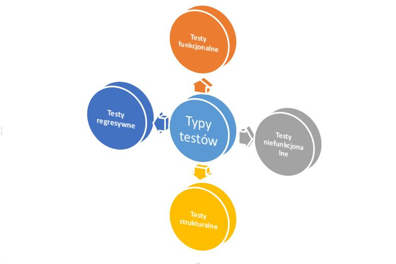

# TYPY TESTÓW

## Testy określonego typu skupiają się na konkretnym celu testu, którym może być którykolwiek z poniższych: 

* przetestowanie jakiejś funkcji wykonywanej przez oprogramowanie, 
* przetestowanie jakiegoś niefunkcjonalnego atrybutu jakościowego \(takiego jak niezawodność lub użyteczność\), 
* przetestowanie struktury lub architektury systemu, 
* testy związane ze zmianami, to jest potwierdzaniem, że usterki zostały naprawione \(testowanie potwierdzające\) i szukaniem niezamierzonych zmian \(testowanie regresywne\).

## Typy testów


1. Testowanie funkcjonalne 
2. Testowanie niefunkcjonalne. 
3. Testowanie strukturalne \(białoskrzynkowe\). 
4. Testowanie związane ze zmianami \(potwierdzające i regresywne\).


